# 总览

> [【新手入门】插件实操【分享汇总】 (kingdee.com)](https://vip.kingdee.com/article/64993872014591232)
>
> [金蝶云星空BOS二次开发案例演示 (kingdee.com)](https://vip.kingdee.com/article/94751030918525696)

## 思维导图


## 开发规范
### 命名规范
- 扩展或新增业务对象时（含转换规则、报表等动态领域模型），其业务对象Key可以选择系统生成的GUID。
- **如果需要自定义业务对象Key，必须以开发商代码加下划线排头**（如∶PAAB_xxxx），且Key长度不允许超过30字符，只能使用字母、下划线。
- 扩展的字段标识和属性必须以开发商代码加下划线排头（如;PAAB xxxx），字段名必须包含开发商代码（如∶F PAAB_xXX)
- 扩展的任何元素，例如标签控件、页签控件、面板控件等，标识必须以开发商代码加下划线排头（如∶PAAB LableXXX，PAAB TabXXX等）。
### 设计规范
- **不允许对一个业务对象或是单据转换，进行多个平级扩展，如果因为多个安装包，或是多个行业产品导致的平行扩展，必须显式指定设置平行扩展加载顺序。**
- 一个单据的字段总数原则上不要超过50个字段（含隐藏字段）。
- 框架布局下，停靠上，下，左，右的元素小于等于1个，中间停靠的等于1个，同时，停靠元素的同级上不允许存在绝对布局元素。
- 字段的默认属性按需设置，例如单据列表默认显示、支持引出、支持引入等需要按照业务进行默认的设置。
- **网控必须配置，防止并发修改数据导致数据错误。**
- 基础资料表单主键设计建议使用整型，否则不支持单据转换。
## 开发流程
### 创建单据时序图


### 修改单据时序图


# 单据页面（窗体）

> 金蝶作为BS+CS混合模式架构内部采用了与C# ASP.NET类似的设计，但单据页面只可使用其提供的封装好的控件，而插件则是依托于页面进行控制显示。

## 文件初始化

1.操作前，首先需要在**集成开发平台**中选择对应的功能模块右键添加所需**子系统**：


2.当需要新建页面时，在该子系统下方的单据列表中右键点击**新增**。可根据实际情况选择新增类型（继承扩展空白）。

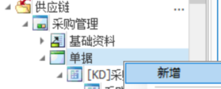

3.当需要修改已有页面并且当前单据列表中还未包含所需页面时，在该子系统上右键选择**引入业务对象**，找到所需的单据页面进行引入。

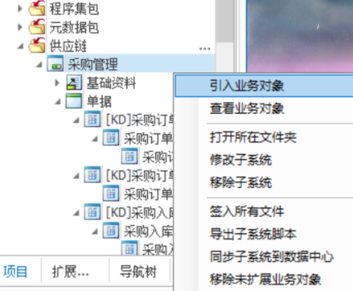

<u>若单据文件**已签入服务器**，则在修改前需要**签出至本地**，否则将会修改失败。</u>

## 页面修改（控件）

在新建或引入已有页面后，就可以对页面进行修改了。但**无法使用**HTML、CSS、JavaScript等前端语言对页面进行修改，而是仅能拖拽已有的控件。页面所有操作须在此处完成，VS无法加载该文件。页面整体功能布局与VS中WinForm类似，工具箱中包含所有控件，中间是所见即所得区，右侧为页面和控件属性。

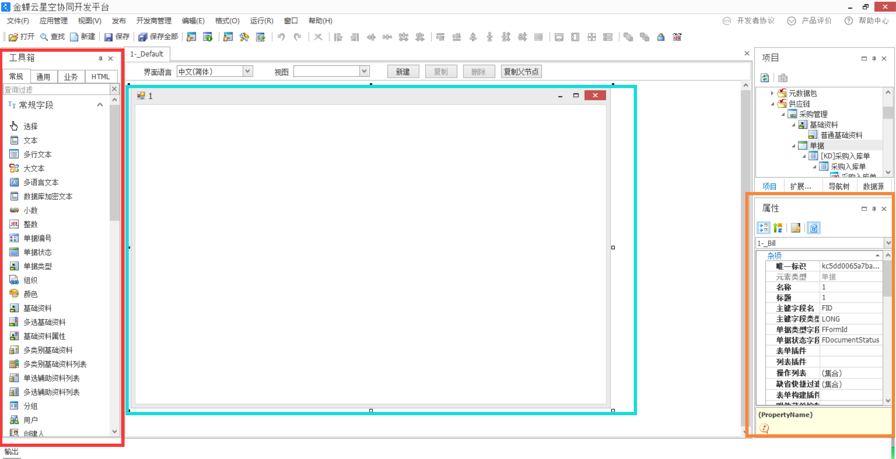

各控件使用方式请自行摸索。

## 附加插件

<a name="附加插件"></a>

上文提到，插件需要依托于单据页面进行运行。根据插件类型，表单插件与列表插件分别注册在相对应的选项内：

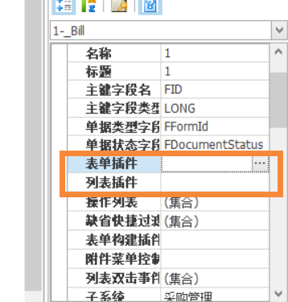

在弹出的**插件配置信息**窗体右侧选择注册（Python插件注册直接复制代码即可）进入到**选择插件**页面。**提前将插件文件复制进金蝶本地网站目录**（通常为：*C:\Program Files (x86)\Kingdee\K3Cloud\WebSite\bin*）中，然后选择网站目录中的插件文件(dll)路径。若插件文件正常，则会在下方显示该dll包含的插件列表。（若此处显示不正常请检查插件文件版本或重新编译生成文件）

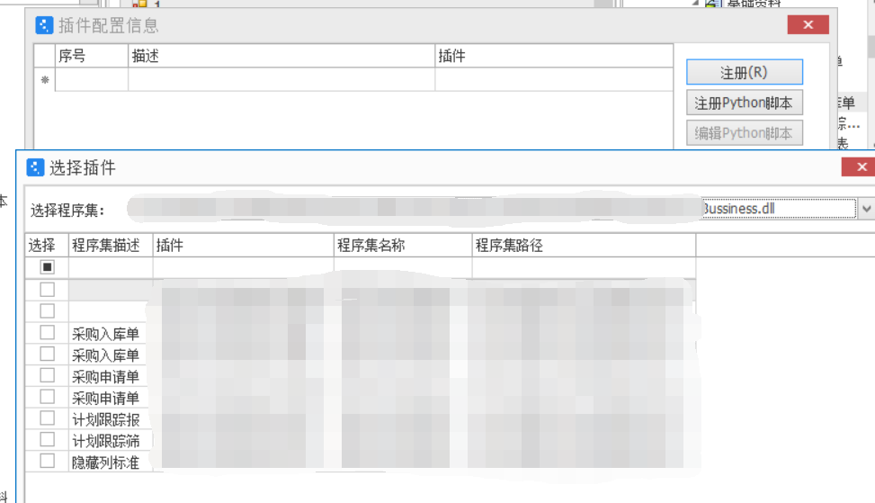

**勾选**所需要的插件并**保存**即可附加成功。

## 页面发布

若页面为**新增的空白页面**，在发布前还需要**增加权限对象**。<u>若仅对已有页面进行修改请跳过此处</u>，直接进入第二项[发布到主控台](#发布到主控台)。**若页面之前已经发布过，直接保存页面并签入服务器即可上线修改后的页面。**

### 1.增加权限对象

1.首先在**属性**中点击**操作列表**，然后在弹出**操作列表**右侧点击**新增**，在**操作编辑**中点击**类型**：

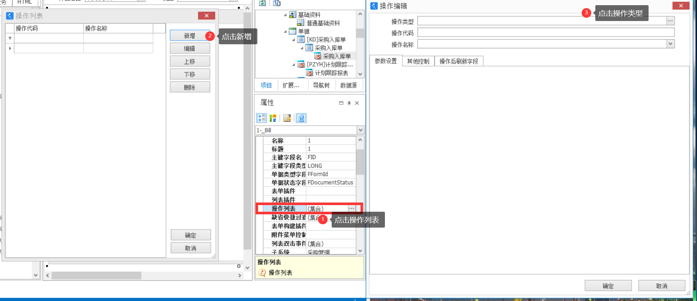

2.在弹出的**操作选择**中选择需要的操作并保存。

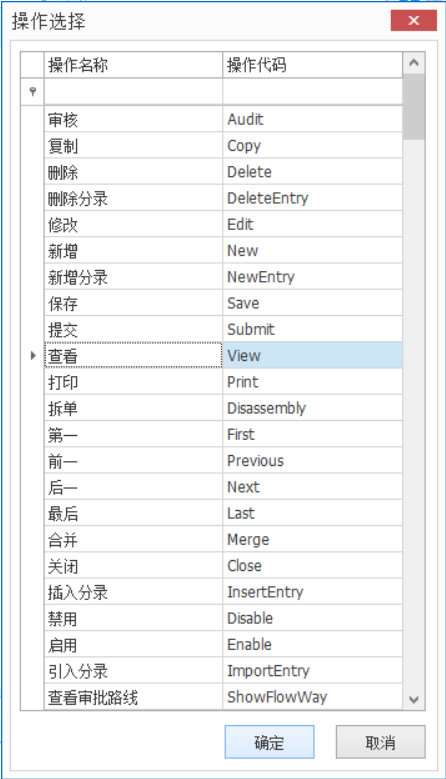

3.回到主页面，点击上方**编辑**中的**权限控制设置**选项。

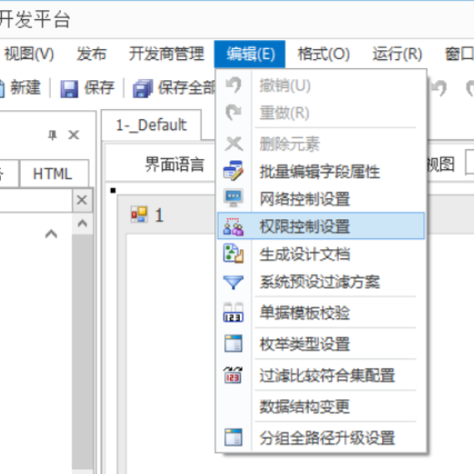

4.在弹出的**权限控制设置**页面中，点击**权限对象**。在弹出的**权限对象**页面中搜素需要的**权限对象**并选择需要的**权限项**。

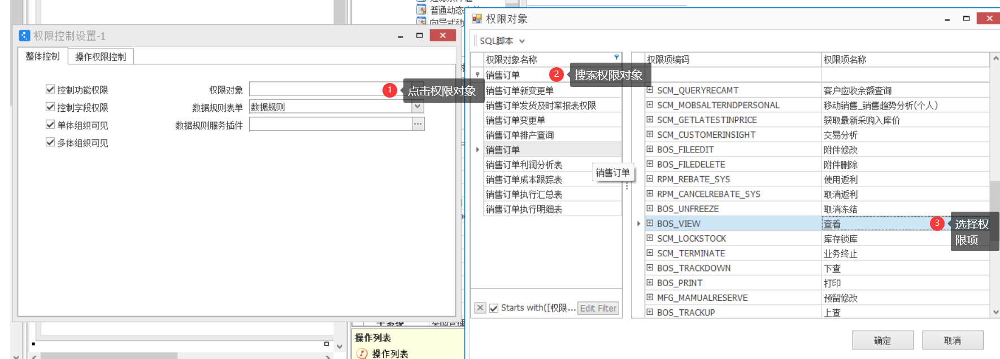

5.回到上一级，选择**操作权限控制**分栏，点击**自动匹配**，则会根据刚刚选择的权限项进行匹配。<u>若此处无法匹配或为空，请重新选择权限对象。</u>

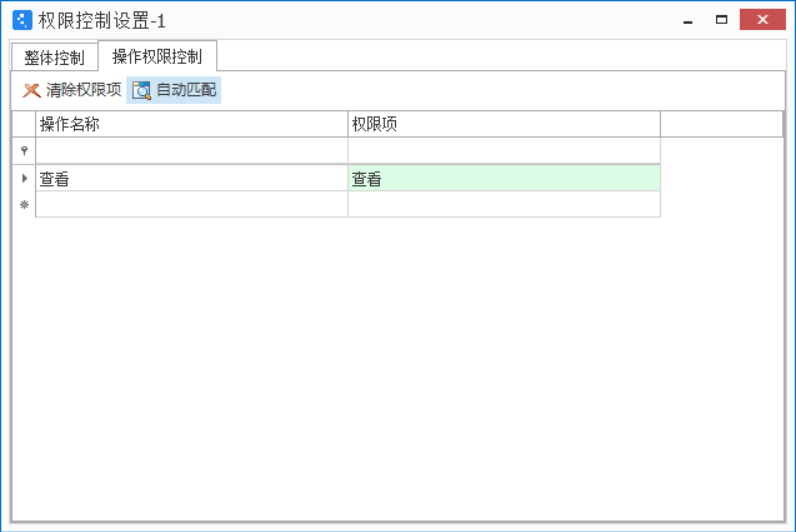

关闭该窗体后**保存**。

### 2.发布到主控台（线上网站）

<a name="发布到主控台"></a>

> 若页面之前已经发布过，直接保存页面并签入服务器即可上线修改后的页面，不需要进行下面的操作。

回到主页面，点击上方**发布**中的**发布到主控台**。在弹出的**功能发布管理**页面首先选择**功能**分类，然后选择**子功能**分类，再根据需求点击**新增**或**修改**。在弹出的**主控台菜单明细维护**窗体中填写菜单信息，**选择单据页面**，匹配设置的**权限项**，选择**发布类型**（如果表中不存数据不需要直接显示select * 请选择**维护**），在最下方选择要**发布的平台**。

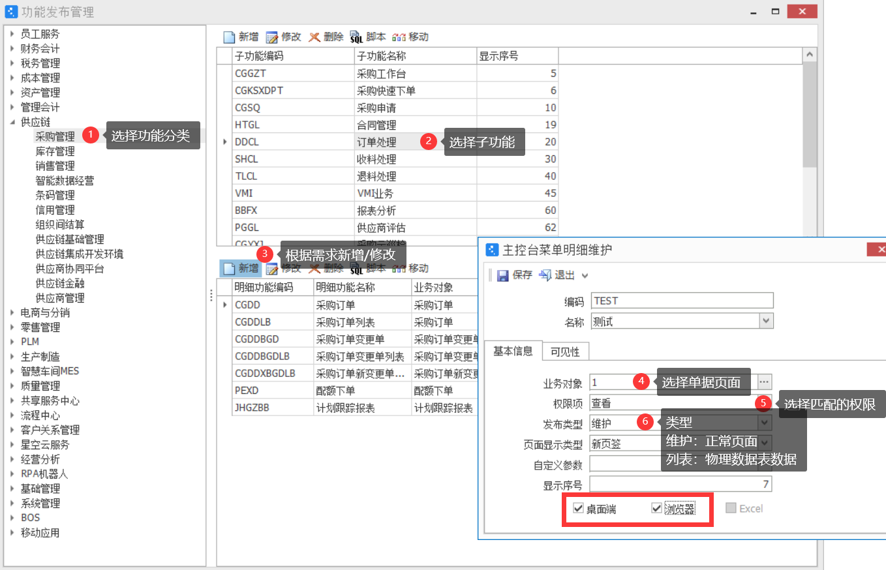

设置完毕后点击保存然后回到主页面，系统会自动发布网页。最后再次**保存**，并在文件列表中**签入单据文件至服务器**。

### 3.金蝶操作

> 若页面之前已经发布过，直接保存页面并签入服务器即可上线修改后的页面，不需要进行下面的操作。

打开浏览器**访问云星空网站**（本地通常是：http://localhost/K3Cloud）。使用当前账套的 **administrator** 账号登录系统，进入**业务对象功能授权**功能，选择要**赋予的角色**，并在下方业务对象中找到页面名称，最后在右侧进行**授权**。至此页面发布完成，可使用**赋予权限的正常账号**登入系统查看。<u>（全功能角色默认可以查看所有页面，不需要另外授权，但显示有一些延迟。）</u>

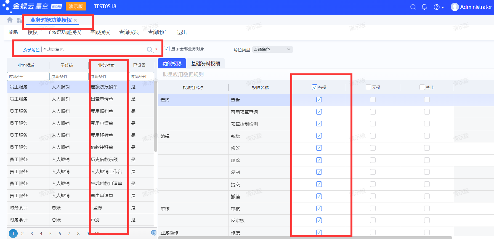

# 插件编写

## Tips：

> 官方问题解答 https://vip.kingdee.com/knowledge?productLineId=1&productId=1&domain=FBOS#tabMain
>
> 金蝶工单系统 https://ticket.kingdee.com

**协同云开发工具修改前需要签出（服务器），保存后再签入（服务器）才可修改成功。**

1.Administrator账户忘记密码可进入【管理中心】—选中【数据中心】后重置其密码。

2.发布单据流程：（1）单据属性页面设置操作列表（2）权限控制第一页中设置权限对象，第二页选择与该权限对象相同的操作（3）发布到主控—选择子功能—新建明细功能绑定业务对象和权限项（4）Administrator账户登录业务网站-业务对象功能授权 授权角色显示

3.二次开发插件上线流程：编写测试完成代码后绑定注册在单据上，签出保存，下载应用-SVN将Code文件夹中自己编写的项目文件commit提交，随后在金蝶BOS平台中右键【程序集包—在线构建】即可生成仅包含插件的部署包，该包安装后会自动将dll文件部署至网站bin目录下。

4.打开应用时显示【XXX is already locked】 在应用总目录下使用SVN Clean up操作清空SVN记录即可。

5.在本地测试打包的内容若多次安装，需要选择补丁包页面的【高级】选项进行重复导入，否则将不会覆盖更新本地数据。

6.所有的数据库**SQL语句**前都需增加 **/\*dialect\*/** 标记，否则可能会报错：

```c#
string sql = $@"/*dialect*/select FBILLNO as '销售订单' from T_SAL_ORDER";
```

7.插件编译完放置网站目录后需要重启IIS才可使用。或可设置热更新重载，无需重启：https://vip.kingdee.com/article/157415?productLineId=1

## 本地调试

由于二次开发插件属于嵌入式开发，编译后生成**动态链接库(.dll)**供金蝶主应用调用，故无法直接运行。调试时需要在装有金蝶本地环境的电脑上进行**附加进程调试**，操作流程如下：

1. 首先编译生成dll文件，在VS中**右键项目生成**，通常生成的dll文件保存在项目文件夹obj目录下。

2. 将生成的文件复制到本地金蝶网站根目录，通常目录为： *C:\Program Files (x86)\Kingdee\K3Cloud\WebSite\bin*

2. 若第一次创建该插件，还需要在单据页面对该插件进行附加，详情见上文[附加插件](#附加插件)。若之前已附加过则可省略该步。

3. 上面提到部署新插件需要重启IIS，或可设置热更新重载。

4. 回到VS，在调试中点击附加到进程，该功能需要**以管理员权限启动VS**，请提前设置。

   

5. 在弹出的进程列表中搜索**w3wp.exe**并选择标题为**K3Cloud**的进程。

   

6. 此时就可以在代码中增加断点，打开相对应的页面即可开始调试。若此时出现未加载或无法调试，请重启IIS或检查生成的dll文件版本后再试。

## 接口结构

> 官方接口文档 [Innovasys RealWorld (kingdee.com)](https://open.kingdee.com/K3Cloud/SDK/webframe.html) 

### AbstractBillPlugIn（单据插件）

#### Context（上下文）

#### ViewPlugin（视图）

| **接口**          | **功能**           |
| ----------------- | ------------------ |
| OnBilInitialize   | 视图模型初始化事件 |
| [AfterBindData](#AfterBindData)     |  绑定数据后事件处理接口             |
| [BeforeF7Select](#BeforeF7Select) | 基础资料弹出前事件 |
| BeforeClosed      | 窗口关闭前事件 |
| [BarItemClick](#BarItemClick)      | 菜单单击事件处理扩展接口 |
| AfterBarItemClick | 菜单单击事件后 |
| BeforeDoOperation | 操作调用前事件 |
| AfterDoOperation  | 操作调用完成后事件 |
| [ButtonClick](#ButtonClick)       | 按钮单击事件 |
| AfterButtonClick  | 按钮单击后事件 |
| ListViewClick     | 列表项目单击事件 |
| TreeNodeClick     | 树控件单击事件 |
| EntityRowClick    | 分录行单击事件 |

#### Model（模型）

动态表单数据模型插件编程接口
定义了数据模型扩展
允许通过接口处理数据,以实现特定业务需求

####  方法

| **方法**   | **功能**           |
| ----------------- | ------------------ |
|CreateNewData|数据模型创建实体对象事件|
|AfterCreateNewData|数据模型创建实体对象完成后事件|
|BeforeUpdateValue|数据更新前事件|
|[DataChanged](#DataChanged)|数据改变后事件|
|CreateNewEntryRow|创建分录行事件|
|BeforeDeleteRow|删除分录行事件|
|AfterDeleteRow|删除分录后事件|
|AfterCopyData|复制单据完毕后事件|
|AfterLoadData|业务对象加载后的扩展接口|
|AfterSave|调用应用服务保存成功后触发|
|AfterSetStatus|设置单据状态后调用|
|AfterSubmit|调用应用服务提交成功后触发|
|[BeforeSave](#BeforeSave)|调用应用服务器，提交数据保存前触发|
|BeforeSetStatus|设置单据状态前调用|
|BeforeSubmit|调用应用服务器，提交前触发|
|CopyData|复制单据|
|LoadData|加载业务对象扩展接口|
|SaveBillFailed|调用应用服务保存失败，出错时触发|
|VerifyImportData|数据导入校验|

## 常用对象

> 单据体行索引从0开始 0为第一行 1为第二行......

### **View**

#### 属性

##### BillBusinessInfo (界面业务对象元数据)

##### LayoutInfo (布局元数据)

##### Model (动态表单模型接口)

##### [OpenParameter](#OpenParameter) (页面调用时传入的参数)

##### BusinessInfo (当前表单对象的逻辑元数据)

##### Context（上下文）

##### Pageld（当前动态表单唯一标识）

##### ParentFormView（父窗体动态表单视图接口）

##### Session（数据缓存区，与其他对象进行简单的数据传递）

##### StyleManager（返回关联的样式管理器）

#### 方法

##### GetFieldEditor (获取界面控件对象) *tips：同JavaScript的获取控件ID控制控件*

```c#
/// <summary>
/// 设置金额列精度
/// </summary>
/// <param name="iScale"></param>
/// <param name="strField"></param>
private void SetColumnScale(short iScale, string strField)
{
	this.View.GetFieldEditor<DecimalFieldEditor>(strField, 1).Scale = iScale;
}
```

##### ShowMessage (显示信息)
<a name="ButtonClick"></a>

```c#
public override void ButtonClick(ButtonClickEventArgs e)
{
	base.ButtonClick(e);
    if (e.Key.Equals(ButtonKey, StringComparison.OrdinalIgnoreCase))
    {
    	this.View.ShowMessage("是兄弟就来砍我");
    }
}
```
##### ShowErrMessage (显示错误信息)

<a name="BarItemClick"></a>

```c#
public override void BarItemClick(BarItemClickEventArgs e)
{
    base.BarItemClick(e);
    switch(e.BarItemKey.ToLower())
    {
        case "tbsplitsave":
        case "tbsave":
            object objCreator = this.Model.GetValue("F_PAE_Creator");
            if(objCreator.IsNullOrEmptyOrWhiteSpace())//判断控件值是否为空
            {
                this.View.ShowErrMessage("对不起，创建人不能为空");
                e.Cancel=true;
            }
    }
}
```

##### GetMainBarItem (主菜单控制) *tips：不能放在初始化里 会被渲染操作给覆盖*
<a name="AfterBindData"></a>

```c#
/// <summary>
/// 数据加载之后，需要处理的功能，这里主要对界面样式进行处理，尽量不要对Datamodel进行处理
/// </summary>
/// <param name="e"></param>
public override void AfterBindData(EventArgs e)
{
    //不可用
	this.View.GetMainBarItem("tbButton").Enabled = false;
    //动态更改菜单按钮名称
    this.View.GetMainBarItem("tbButton").Text = "屠龙宝刀 点击就送";
}
```

##### GetControl (控件控制)

```c#
//禁用FNote控件
this.View.GetControl("FNote").Enabled = false;

//获取焦点 光标转移至该控件
this.View.GetControl("FNote").SetFocus();
```

##### GetFieldEditor（单据体控制）

```c#
//禁用单据体中FEntryNote列的第0行
this.View.GetFieldEditor("FEntryNote",0).Enabled = false;
```
##### GetFormTitle （获取单据标题）

```c#
string FormTitle = this.View.GetFormTitle();
```
##### UpdateView（刷新页面）

```c#
this.View.UpdateView("FNote");
```

##### Refresh（刷新页面及数据）

```c#
this.View.Refresh();
```

##### InvokeFormOperation（调用表单事件）

```c#
this.View.InvokeFormOperation("Save");
```

##### GetFormOperation（获取指定操作编码的的操作实例对象）

##### LockField（锁定或者解锁字段）

##### GetBarltem（获取工具栏、按钮、分录表格菜单项控件编程对象）

##### [ShowForm](#ShowForm)（显示动态表单界面 关闭窗体时有回调函数处理)

##### SendDynamicFormAction（执行指定动态表单视图的客户端指令）

##### InvokeFieldUpdateService（执行指定字段的表单服务）

### Model

#### 属性

##### Context（上下文）

##### DataObject (当前对象的数据实体) *tips:常用于CreateNewData*

```c#
/// <summary>
/// 获取分类目录
/// </summary>
DynamicObjectCollection entrys = (DynamicObjectCollection)this.Model.DataObject["PoorderEntry"];

//获取单据体指定列数据 tips：参数为数据库元祖名去掉开头的F
//查询单据内码
string FormTitle = this.Model.DataObject["Id"].ToString();
```

#### 方法

##### CreateNewEntryRow（新增行单据体信息）
```c#
this.Model.CreateNewEntryRow("FSaleOrderEntry");
```
##### GetEntryCurrentRowIndex（获取分录当前行索引）

##### TryGetEntryCurrentRow（尝试返回某个分录的当前选中的实体）

##### InsertEntryRow（插入分录行）

##### GetEntityDataObject（获取单据体分录对应的数据集合）

##### WriteLog（写上机操作日志）

##### FuncPermissionAuth（判断功能权限）

##### GetEntryRowCount（获取单据体数据行数量）

```c#
this.Model.GetEntryRowCount("FSaleOrderEntry");
```

##### GetPKValue（获取单据内码）

```c#
string FormTitle = this.Model.GetPKValue().ToString();
```
##### GetEntryPKValue（获取单据体内码）

```c#
this.Model.GetEntryPKValue("FSaleOrderEntry", 0);
```

##### CopyEntryRow（复制行单据体信息）

```c#
this.Model.CopyEntryRow("FSaleOrderEntry", 0, 1, false);//最后一个参数代表是否携带源单关系
```

##### DeleteEntryData（删除单据体信息）

```c#
this.Model.DeleteEntryData("FSaleOrderEntry");
```

##### DeleteEntryRow（指定行删除单据体信息）

```c#
this.Model.DeleteEntryRow("FSaleOrderEntry",0);
```
##### GetValue（获取字段(对象)值）

```c#
string message = "";
//获取单据头文本字段
object billNo = this.Model.GetValue("FBillNo");
if (billNo != null)
{
	message += "[FBillNo:" + billNo.ToString() +"]" ;
}

//获取基础资料字段
DynamicObject baseCoin = this.Model.GetValue("F_PAE_BaseCoin") as DynamicObject;
if (baseCoin != null)
{
	message += "[F_PAE_BaseCoin:" + baseCoin["Name"] + "]";
}

//获取单据体中的所有行数据
Entity fentity = this.View.BillBusinessInfo.GetEntity("FEntity");
DynamicObjectCollection entityObjs = this.Model.GetEntityDataObject(fentity);
for (int i = 0; i < entityObjs.Count; i++)
{
	message += "[row" + (i + 1) + ":" + entityObjs[i]["F_PAE_ItemName"] + "]";
}

//获取单据体选中行的数据
Entity fentity = this.View.BillBusinessInfo.GetEntity("FEntity");
int[] selectedRows = this.View.GetControl<EntryGrid>("FEntity").GetSelectedRows();
DynamicObjectCollection entityObjs2 = this.Model.GetEntityDataObject(fentity);
foreach (var row in selectedRows)
{
	message += "[selected row" + (row + 1) + ";" + entityObjs2[row]["F_PAE_ItemName"] + "]";
}

//快速获取单据体中某字段的值(如果行不存在时，会中断)
object itemName = this.Model.GetValue("F_PAE_ItemName", 0);
if (itemName != null)
{
	message += "[quick row 1:" + itemName.ToString() + "]";
}
this.View.ShowMessage(message);
```

##### SetValue (设置字段(对象)值)
<a name="DataChanged"></a>

```c#
/// <summary>
/// 字段修改事件函数重载
/// </summary>
/// <param name="e"></param>
public override void DataChanged(DataChangedEventArgs e)
{
    //数据改变时使用switch进行多选判断
	switch(e.Key.ToUpper())
    {
    	case "FPARENTDEPTID":
            this.Model.SetValue("FFullName", GetFullName(e.Key));
            break;
    }
    
    //根据另一个控件值赋值控件
    this.Model.SetValue("F_UPPS_Text1", this.Model.GetValue("F_UPPS_Text").ToString());
    
    //根据 Context 上下文属性取控件值
    this.Model.SetValue("F_UPPS_Text1", Convert.ToString(this.Context.DatabaseType));//强转为string
        
    //设置单据头字段的值
    this.Model.SetValue("FBillNo","test setValue");
    
    //设置基础资料的值(根据内码)
    this.Model.SetValue("F_PAE_BaseCoin", "1");
    
    //设置基础资料的值(根据编码)
    this.Model.SetItemValueByNumber("F_PAE_BaseCoin",“PRE001", -1);
                                    
    //设置单据体中字段的值 (字段，数值，行数)
    this.Model.SetValue("F_PAE_Quantity", 5, 0);
    this.Model.SetValue("F_PAE_Price", 20, 0);
                                    
    //根据改变发生的字段
    if(e.Field.Key=="")
	{
        //给A字段FCustIdNew,赋新值e.NewValue,更新前的值
        this.Model.SetValue("FCustIdNew",e.NewValue);
        //给B字段FCustIdOld,赋旧值e.OldValue,更新后的值
        this.Model.SetValue("FCustIdOld",e.OldValue);
        //根据单据体内容更改 改变相同记录中的字段
        this.Model.SetValue("F_YDIE_ProjectName", "项目名称" +e.Row.ToString(), e.Row);
    }
                                    
	//操作控件过多时可通过switch case简化代码 避免多个if
	switch(e.Field.Key)
	{
        case "":;break;
    }
}
```
## 示例代码

### DynamicObject（单据数据包）

相当于一个**有层次结构的数据字典**
基本特征：

1. 包含了全部单据头字段值

2. 包含了单据体行集合对象

3. 字段通过Key + Value，形成一个键值对，占据DynamicObject的一个节点

4. 字段在数据包中的Key，使用的是字段的属性名

5. 基础资料字段的值，也是一个DynamicObject对象，其中嵌套包含了各个引用属性的值

   > [DynamicObject动态数据包分析 (kingdee.com)](https://vip.kingdee.com/article/45021)
   > [DynamicObject结构说明 - 苏暖暖 - 博客园 (cnblogs.com)](https://www.cnblogs.com/nikki1206/p/15488889.html)

#### 方法一：直接操作DynamicObject
```c#
// 假设billObj是单据的数据包
DynamicObject billObj = this.Model.DataObject;

// 读取单据内码
long billId = Convert.ToInt64(billObj[0]);

// 普通文本字段（读取 + 设置）
string fldBillNoValue = Convert.ToString(billObj["BillNo"]);
billObj["BillNo"] = fldBillNoValue ;

// 日期字段（读取 + 设置）
DateTime fldDateValue = Convert.ToDateTime(billObj["F_JD_Date"]);
billObj["F_JD_Date"] = fldDateValue;

// 基础资料字段(读取 + 设置)
DynamicObject fldSupplierValue = billObj["F_JD_Supplier"] as DynamicObject;
billObj["F_JD_Supplier"] = fldSupplierValue ;
if (fldSupplierValue != null)
{ 
    billObj["F_JD_Supplier_Id"] = Convert.ToInt64(fldSupplierValue[0]);
    long supplierId = Convert.ToInt64(fldSupplierValue[0]);
    string supplierNumber = fldSupplierValue["Number"].ToString();
    string supplierName = fldSupplierValue["Name"].ToString();
}

// 单据体（单据体行集合属性本身只读，可以通过单据体集合提供的方法，添加行、删除行）
DynamicObjectCollection entityRows = billObj["FEntity"] as DynamicObjectCollection;
foreach (var entityRow in entity1Rows)
{
    // 内码
    long entityId = Convert.ToInt64(entityRow[0]);
    // 数量 （读取 + 设置）
    decimal fldQtyValue = Convert.ToDecimal(entityRow["F_JD_Qty"]);
    entityRow["F_JD_Qty"] = fldQtyValue;
}
```

#### 方法二：通过字段的元数据，操作DynamicObject

```c#
// 假设billObj是单据的数据包
DynamicObject billObj = this.Model.DataObject;

// 首先获取各种元素的元数据
Field fldBillNo = this.View.BillBusinessInfo.GetField("FBillNo");
Field fldDate = this.View.BillBusinessInfo.GetField("F_JD_Date");
BaseDataField fldSupplier = this.View.BillBusinessInfo.GetField("F_JD_Supplier") as BaseDataField;
BaseDataField fldMaterial = this.View.BillBusinessInfo.GetField("F_JD_FMaterialId") as BaseDataField;
Field fldQty = this.View.BillBusinessInfo.GetField("F_JD_Qty");
Entity entity = this.ListView.BillBusinessInfo.GetEntity("FEntity");

// 读取单据内码
long billId = Convert.ToInt64(billObj[0]);

//单据编号
string billNo = Convert.ToDateTime(fldBillNo.DynamicProperty.GetValue(billObj));
fldBillNo.DynamicProperty.SetValue(billObj, billNo));

// 日期
DateTime fldDateValue = Convert.ToDateTime(fldDate.DynamicProperty.GetValue(billObj));
fldDate.DynamicProperty.SetValue(billObj, fldDateValue)
    
// 供应商：基础资料字段
DynamicObject fldSupplierValue = fldSupplier.DynamicProperty.GetValue(billObj) as DynamicObject;

// 设置供应商基础字段值
DynamicObject[] supplierObjs = Kingdee.BOS.ServiceHelper.BusinessDataServiceHelper.LoadFromCache(
this.Context,
new object[] { fldSupplierValue[0] },
fldSupplier.RefFormDynamicObjectType);
fldSupplier.RefIDDynamicProperty.SetValue(billObj, supplierObjs[0][0]);
fldSupplier.DynamicProperty.SetValue(billObj, supplierObjs[0]);

// 基础资料属性值
if (fldSupplierValue != null)
{
    long supplierId = Convert.ToInt64(fldSupplierValue[0]);
    string supplierNumber = fldSupplier.GetRefPropertyValue(fldSupplierValue, "FNumber").ToString();
    string supplierName = fldSupplier.GetRefPropertyValue(fldSupplierValue, "FName").ToString();
}

// 单据体的字段
DynamicObjectCollection entityRows = entity.DynamicProperty.GetValue(billObj) as DynamicObjectCollection;
foreach (var entityRow in entityRows)
{
    // 内码
    long entityId = Convert.ToInt64(entity1Row[0]);
    // 物料：基础资料字段
    DynamicObject fldMaterialValue = fldMaterial.DynamicProperty.GetValue(entityRow) as DynamicObject;
    if (fldMaterialValue != null)
    {
        long materialId = Convert.ToInt64(fldMaterialValue[0]);
        string materialNumber = fldMaterial.GetRefPropertyValue(fldMaterialValue, "FNumber").ToString();
        string materialName = fldMaterial.GetRefPropertyValue(fldMaterialValue, "FName").ToString();
    }
    // 数量
    decimal fldQtyValue = Convert.ToDecimal(fldQty.DynamicProperty.GetValue(entityRow));
    fldQty.DynamicProperty.SetValue(entityRow, fldQtyValue);
}

// 给单据体添加新行
DynamicObject newRow = new DynamicObject(entity.DynamicObjectType);
entityRows.Add(newRow);
```

#### 获取基础资料控件的名称

> 在开发平台中控件的属性里设置 
>
> 关联检索字段： 【编码】 
>
> 管理基础资料字段名： 【名称】

```c#
private string GetBaseDataNameValue(DynamicObjectCollection dyobj)
{
    string name = "";
    foreach (DynamicObject dynbj in dyobj)
    {
    	if (dynbj != null || !dynbj.DynamicObjectType.Properties.Contains("Name"))
        {
            DynamicObject dynbj2 = (DynamicObject)dynbj[2];
            name = name + "," + dynbj2["Name"].ToString();
        }
    }
    if (name.Length > 0)
    {
    	name = name.Substring(1, name.Length - 1);
    }
    return name;
}
```

#### 为基础资料控件赋值

```c#

```


### 单据操作

#### 控件属性调整

```c#
//1、可见性设置
this.View.GetControl("FButton").SetCustomPropertyValue("visible", true);

//2、锁定性设置
this.View.GetControl("FDate").SetCustomPropertyValue("disabled", true);

//3、按钮、标签背景色设置
this.View.GetControl("FButton").SetCustomPropertyValue("backcolor", "115,208,241");

//4、按钮、标签字体颜色设置
this.View.GetControl("FButton").SetCustomPropertyValue("forecolor", "255,255,255");

//5、按钮、标签文本值设置
this.View.GetControl("FLable").SetCustomPropertyValue("value", "我是标签");

//6、高度、宽度设置（单据体字段也可使用）
this.View.GetControl("FDocEntity").SetCustomPropertyValue("height",100);
this.View.GetControl("FDocEntity").SetCustomPropertyValue("width", 320);

//7、设置页签控件的当前选中页签
this.View.GetControl("FTab").SetCustomPropertyValue("selectedIndex", 2);

//8、设置控件背景图片
this.View.GetControl("FButton").SetCustomPropertyValue("backgroundurl", "img.png");

//9、图片控件设置图片
this.View.GetControl("FImage").SetCustomPropertyValue("imageKey", "img.png");
```

#### 更改单据体行背景色

```c#
/// <summary>
/// 更改单据体颜色
/// </summary>
/// <param name="view">页面视图</param>
/// <param name="entityKey">单据体标识</param>
/// <param name="color">颜色</param>
/// <param name="rowIndex">行数</param>
private static void GridSetRowBackcolor(IDynamicFormView view, string entityKey, string color, int rowIndex)
{
	var value = new JSONObject
	{
		[rowIndex.ToString()] = color
	};
	var jo = new JSONObject
	{
		["backcolor"] = value
	};
    var grid = view.GetControl<EntryGrid>(entityKey);
	var formState = view.GetService<IDynamicFormState>();
	formState.AftInvokeControlMethod(grid.ControlAppearance, "UpdateFieldStates", jo);
}

//使用时调用
GridSetRowBackcolor(this.View, entityKey, "#FFBD7E", j);
```

#### 单据列表

> 在进行单据动态写入时，必须要将每一格都填充内容，否则无法显示！空值可填充为“”。

```c#
//隐藏快捷过滤
this.View.GetControl("FQkFilterPanel").SetCustomPropertyValue("visible", false);

//清空原数据
Model.DeleteEntryData("F_PZYH_Entity");
//创建新行
Model.CreateNewEntryRow("FList");

//获取行选择信息
ListSelectedRowCollection listcoll = this.ListView.SelectedRowsInfo;
//定义字段,赋值
DynamicObjectCollection dycoll = this.ListModel.GetData(listcoll);
//通过循环,读取数据
for (int i = 0; i < dycoll.Count; i++)
{
}
//增加动态列
public override void CreateListHeader(CreateListHeaderEventArgs e) 
{ 
    base.CreateListHeader(e); 
    var header = e.ListHeader.AddChild(); 
    header.Caption = new LocaleValue("动态列1"); 
    header.Key = "FDynamicColumn1"; 
    header.FieldName = "FDynamicColumn1"; 
    header.ColType = SqlStorageType.Sqlnvarchar; 
    header.Width = 200; 
    header.Visible = true; 
    header.ColIndex = e.ListHeader.GetChilds().Max(o => o.ColIndex) + 1;
    header = e.ListHeader.AddChild(); 
    header.Key = "FDynamicColumn2"; 
    header.FieldName = "FDynamicColumn2";
    header.Caption = new LocaleValue("动态列2");
    header.ColType = SqlStorageType.Sqlnvarchar; 
    header.Width = 300; 
    header.Visible = true; 
    header.ColIndex = e.ListHeader.GetChilds().Max(o => o.ColIndex) + 1; 
}
```

#### 动态生成列表（搭配使用进行个性化显示并自定义隐藏列）

**通过该操作可以简化为固定字段列表赋值，无需一个一个使用Set，仅需在初始定义的字段序列中修改。**

此处通过JSON对象来存储用户显示列数据，具体格式如下图：


此处序号作为列表的字段顺序，显示宽度作为列表的每一字段宽度。通过与下方自定义隐藏列搭配使用可进行个性化配置。此外字段名用作列表的列名显示。而备注是有可能存在sql需要英文而列名是中文无法对应的情况或是打算对应成别的名称，通过在备注中写入对应想要显示的名字将会优先显示备注，无备注或备注内容为空将会使用字段名显示。

```c#
//初始化隐藏列
public JObject CSHYCL()
{
    YCLINFO = new JObject();
    JArray jArray = new JArray();
    for (var i = 0; i < fieldNames.Length; i++)
    {
        JObject job = new JObject
        {
            ["序号"] = i,
            ["字段名"] = fieldNames[i],
            ["显示宽度"] = 100,
            ["备注"] = ""
        };
        if (fieldNames[i]== "FBILLNO")
        {
            job["备注"] = "销售订单编号";
        }
        else if(fieldNames[i]== "FDATE")
        {
            job["备注"] = "订单日期";
        }
        //循环新增json对象
        jArray.Add(job);
    }
    YCLINFO["data"] = jArray;
    return YCLINFO;
}
```

**另外需要将该JSON对象序列化成字符串并存入数据库，后续打开时通过反序列化读取该JSON对象达到存储用户配置的目的。**

```c#
string[] fieldNames ={"首先定义需要的字段","每个字段为一格"};
const string entityKey = "F_PZYH_Entity";//指定拖拽的单据体名

/// <summary>
/// 动态创建表格列并绑定数据
/// </summary>
private void BindData()
{
    var actionData = new JSONObject();
    actionData["key"] = entityKey;
    actionData["methodname"] = "CreateDyanmicList";
    JSONArray coMeta = new JSONArray();
    //添加需要创建的列
    coMeta.Add(GetColumns());
    coMeta.Add("");
    actionData["args"] = coMeta;
    this.View.AddAction("InvokeControlMethod", actionData, x =>
                        {
                            //单据体动态创建列之后通过回调方式为该单据体添加数据
                            this.View.GetControl<EntryGrid>(entityKey)?.SetData(CESHI());
                        });
}

/// <summary>
/// 生成动态列指令集
/// </summary>
/// <returns></returns>
private JSONObject GetColumns()
{
    // 生成构建表格的指令集
    var entityAppearance = this.View.LayoutInfo.GetEntityAppearance(entityKey);//entity为单据体名称
    var gridMeta = entityAppearance.CreateControl();
    gridMeta.Put("primaryKey", ExtConst.GRID_INDEX_FIELD_KEY);
    gridMeta.Put("indexKey", ExtConst.GRID_INDEX_FIELD_KEY);
    gridMeta.Put("startRow", 0);
    gridMeta.Put("pageSize", entityAppearance.PageRows);
    //gridMeta.Put("editable", false);
    // 生成列
    var columns = (JSONArray)gridMeta["columns"];
    JArray jArray = (JArray)YCLINFO["data"];
    fieldNames2 = new string[jArray.Count];
    for (int i = 0; i < jArray.Count; ++i)
    {
        JObject column = (JObject)jArray[i];
        string fieldName = (string)column["字段名"];
        fieldNames2.SetValue(fieldName, i);
        //备注不为空则显示备注名称
        if (!string.IsNullOrWhiteSpace((string)column["备注"]))
        {
            fieldName = (string)column["备注"];
        }
        var col = new JSONObject();
        var xtype = "textfield";
        col.Put("xtype", xtype);
        col.Put("colIndex", (int)column["序号"] + 2);
        col.Put("dataIndex", fieldName);
        col.Put("header", fieldName);
        col.Put("width", column["显示宽度"]);
        if ((string)column["显示宽度"] == "0")
        {
            col.Put("visible", false);
        }
        else
        {
            col.Put("visible", true);
        }
        // 如果需要某列的单元格可编辑，必须设置该列的编辑控件属性
        // col.Put("editor", CreateEditorControl(xtype));
        columns.Add(col);
    }
    return gridMeta;
}

//单独赋值
public JSONObject CESHI()
{   
    var data = new JSONObject();
    var rows = new JSONArray();
    string sql = @"";
    int j = 0;
    //清空原数据
    Model.DeleteEntryData("F_UPPS_Entity");
    //执行sql语句返回DataSetDBUtils.ExecuteEnumerable
    IEnumerable<IDataRecord> itemDataTable = DBUtils.ExecuteEnumerable(Context, sql);
    //IEnumerable按行读取
    foreach (IDataRecord drItem in itemDataTable)
    {
        var row = new JSONArray();
        row.Add(j);
        row.Add(j);
        foreach (var fieldName in fieldNames2)
        {
            row.Add(Convert.ToString(drItem[fieldName]));                    
        }
        rows.Add(row);
        j++;
    }            
    data.Put("rows", rows);
    return data;
}
```

#### 自定义隐藏列（搭配页面可直接作为模板使用，仅需更改传入参数值，无需修改代码）

通过该页面可以实现动态表单无法调用金蝶原本的快捷过滤功能。通过动态生成列表显示，调整生成列的列名与行宽，并分用户进行保存，达到自定义显示的效果。


```c#
 JObject YCLINFO;

 public override void OnInitialize(InitializeEventArgs e)
 {
 	YCLINFO = (JObject)this.View.OpenParameter.GetCustomParameter("YCLINFO");//初始化传入参数YCLINFO
 }
 public override void AfterBindData(EventArgs e)
 {
     base.AfterBindData(e);
     //禁用列 避免被修改
     this.View.GetControl("F_PZYH_Text").SetEnabled("F_PZYH_Text", false);
     this.View.GetControl("F_PZYH_Text1").SetEnabled("F_PZYH_Text1", false);
     var Entity = this.View.GetControl<EntryGrid>("F_PZYH_Entity");

    JArray jArray = (JArray)YCLINFO["data"];
    for (int i = 0; i < jArray.Count; i++)
    {
        Model.CreateNewEntryRow("F_PZYH_Entity");
        JObject column = (JObject)jArray[i];
        int j = (int)column["序号"];
		Model.SetValue("F_PZYH_Text", j + 1, j);
        if (string.IsNullOrWhiteSpace((string)column["备注"]))
        {
        	Model.SetValue("F_PZYH_Text1", (string)column["字段名"], j);
        }
        else
        {
        	Model.SetValue("F_PZYH_Text1", (string)column["备注"], j);
        }
		Model.SetValue("F_PZYH_Text2", Convert.ToInt32((string)column["显示宽度"]), j);
		//备份数据库字段名
		Model.SetValue("F_PZYH_Text3", (string)column["字段名"], j);
		Entity.SetBackcolor("F_PZYH_Entity", "#FF0000", j);
	}
	Model.DeleteEntryRow("F_PZYH_Entity", jArray.Count);
	View.UpdateView("F_PZYH_Entity");
}
public override void DataChanged(DataChangedEventArgs e)
{
    base.DataChanged(e);
    int row = this.Model.GetEntryCurrentRowIndex("F_PZYH_Entity");
    var num = Convert.ToInt32(this.Model.GetValue("F_PZYH_Text2", row));
    if (num<0)
    {
        this.View.ShowErrMessage("数值输入错误 请输入正确数字！");
        this.Model.SetValue("F_PZYH_Text2","100" , row);
    }
}
public override void ButtonClick(ButtonClickEventArgs e)
{
    int row = this.Model.GetEntryCurrentRowIndex("F_PZYH_Entity");
    Entity fentity = this.View.BillBusinessInfo.GetEntity("F_PZYH_Entity");
    DynamicObjectCollection entityObjs = this.Model.GetEntityDataObject(fentity);
    switch (e.Key.ToUpperInvariant())//控件名大写
    {
        case "F_PZYH_BUTTON":
        this.View.ReturnToParentWindow(new JObject { ["msg"] = "重置" });
        this.View.Close();
        break;
        case "F_PZYH_BUTTON21":
        JArray jArray = new JArray();
        for (int i = 0; i < entityObjs.Count; i++)
        {
            jArray.Add(new JObject
            {
                ["序号"] = i,
                ["字段名"] = Convert.ToString(entityObjs[i]["F_PZYH_Text3"]),
                ["显示宽度"] = Convert.ToInt32(entityObjs[i]["F_PZYH_Text2"]),
                ["备注"] = Convert.ToString(entityObjs[i]["F_PZYH_Text1"])
        	});
		}
        this.View.ReturnToParentWindow(new JObject { ["data"] = jArray });
        this.View.Close();
        break;
        case "F_PZYH_BUTTON22":
        	this.View.Close();
        	break;
        case "F_PZYH_BUTTON1"://上移
            if(row - 1< 0)
            {
            	this.View.ShowErrMessage("该字段已处于第一行！");
            }
            else
            {
            	Move(row, row - 1);
            }
        	break;
        case "F_PZYH_BUTTON2"://下移
            if (row + 1 > entityObjs.Count)
            {
            	this.View.ShowErrMessage("该字段已处于最后！");
            }
            else
            {
            	Move(row, row + 1);
            }
            break;
	}
}
/// <summary>
/// 移动行 字段排序
/// </summary>
/// <param name="row">行数</param>
/// <param name="dire">方向</param>
public void Move(int row , int direction)
{
    var zdm = Model.GetValue("F_PZYH_Text1", row);
    var kd = Model.GetValue("F_PZYH_Text2", row);
    var sjk = Model.GetValue("F_PZYH_Text3", row);

    Model.SetValue("F_PZYH_Text1", Model.GetValue("F_PZYH_Text1", direction), row);
    Model.SetValue("F_PZYH_Text2", Model.GetValue("F_PZYH_Text2", direction), row);
    Model.SetValue("F_PZYH_Text3", Model.GetValue("F_PZYH_Text3", direction), row);

    Model.SetValue("F_PZYH_Text1", zdm, direction);
    Model.SetValue("F_PZYH_Text2", kd, direction);
    Model.SetValue("F_PZYH_Text3", sjk, direction);
    //设置光标焦点行
    this.View.SetEntityFocusRow("F_PZYH_Entity", direction);
    View.UpdateView("F_PZYH_Entity", direction);
    View.UpdateView("F_PZYH_Entity", row);
}
```

### 查询数据

```c#
var formMetaData = FormMetaDataCache.GetCachedFormMetaData(this.Context, "PAE_ZyDemoBase3");
var dynamicObjType = formMetaData.BusinessInfo.GetDynamicObjectType();
string result = "";
//根据内码来查询单据数据
DynamicObject dynamicObj = BusinessDataServiceHelper.LoadSingle(this.Context, "100001", dynamicObjType);
if (dynamicObj != null)
{
	this.View.ShowMessage(dynamicObj["BILLM0"].ToString());
}

//根据内码查询多条数据
DynamicObject[] dynamic0bjs = BusinessDataServiceHelper.Load(this.Context, new object[] { " 10001", "10002" }, dynamicObjType);
foreach (var obj in dynamic0bjs)
{
	result +=obj["BILLNO"].ToString();
}
this.View.ShowErrMessage(result);

//根据自定义的查询条件来查询单据数据
QueryBuilderParemeter query = new QueryBuilderParemeter();
query.FormId ="PAE_ZyDenoBase3";
query.FilterClauseWihtKey = "FNillNo='F001'";//单据编号 根据key 
query.BusinessInfo = formMetaData.BusinessInfo;
query.SelectItems.Add(new SelectorItemInfo("BillNo"));
DynamicObject[] dynamic0bjs = BusinessDataServiceHelper.Load(this.Context, dynamicObjType, query);
foreach(var obj in dynamic0bjs)
{
	result += obj["BILLNO"].ToString() + ",";
}
this.View.ShowErrMessage(result);

//自定义查询条件以及查询列
List<SelectorItemInfo> selectItems = new List<SelectorItemInfo>();
selectItems.Add(new SelectorItemInfo("FBi1lNo"));
selectItems.Add(new SelectorItemInfo("F_PAE_Base"));
OQLFilter oFilter = new OQLFilter();
oFilter.Add(new OQLFilterHeadEntityItem() { FilterString = "FBillBNo='F001'" });
oFilter.Add(new OQLFilterHeadEntityItem() { EntityKey="FEntity",FilterString = "F_PAE_Base=110958" });//根据单据体某个字段
oFilter.Add(new OQLFilterHeadEntityItem() { EntityKey = "FEntity", FilterString = "F_PAE_Base.FNumber" });//根据单据体基础资料编码
DynamicObject[] dynamicObjs = BusinessDataServiceHelper.Load(this.Context, "PAE_ZyDemoBase3", selectItems, oFilter);
foreach(var obj in dynamicObjs)
{
	result +=obj["BILLNO"].ToString() + ",";
}
this.View.ShowErrMessage(result);

//queryservice取数 通过业务对象获取数据
public DynamicObjectCollection GetQueryDatas()
{
    QueryBuilderParemeter paramCatalog = new QueryBuilderParemeter()
    {
        FormId = "",//取数的业务对象
        FilterClauseWihtKey = "",//过滤条件，通过业务对象的字段Key拼接过滤条件
        SelectItems = SelectorItemInfo.CreateItems("", "", ""),//要筛选的字段【业务对象的字段Key】，可以多个
    };
    DynamicObjectCollection dyDatas = QueryServiceHelper.GetDynamicObjectCollection(this.Context, paramCatalog);
    return dyDatas;
}
```

### 弹窗

#### 弹出子窗体
<a name="ShowForm"></a>
```c#
DynamicFormShowParameter formPa = new DynamicFormShowParameter();
formPa.FormId = "窗体标识";
//传自定义参数
formPa.CustomComplexParams.Add("JHGZ", jHGZ);
this.View.ShowForm(formPa);
```

#### 子窗体返回数据至父窗体
<a name="OpenParameter"></a>

> 也可通过自定义实体类进行传递。父窗体在View.ShowForm中传，子窗体在View.ReturnToParentWindow中直接返回对象。

```c#
//子窗体在OnInitialize中接收上一步传递的自定义参数
this.View.OpenParameter.GetCustomParameter("JHGZ");
//并可在AfterCreateNewData中操作接收的数据（如界面初值）

//返回子窗体数据
this.View.ReturnToParentWindow(this.Model.DataObject); 

//父窗体设置
DynamicObject dyo;
int selectedRow = 0;
this.Model.TryGetEntryCurrentRow("FEntity", out dyo, out selectedRow);
if (dyo != null)
{
    DynamicFormShowParameter param = new DynamicFormShowParameter();
    param.FormId = "PAE_ZyDemoBase2";
    param.CustomComplexParams.Add(" SelectItem", dyo);
    this.View.ShowForm(param, (result) =>
    {
        if (result != null)
        {
            DynamicObject resultDyo = result.ReturnData as DynamicObject;
            if (resultDyo == null)
            	return;
            this.Model.SetValue("F_PAE_ItenName", resultDyo["F_PAE_ItenName"]);
            this.Model.SetValue("F_PAE_Price", resultDyo["F_PAE_Price"]);
            this.Model.SetValue("F_PAE_Quantity", resultDyo["F_PAE_Quantity"]);
        }
    });
}
```
#### 提示信息框

##### 询问式

```c#
//MessageBoxOptions.YesNo 是、否
//MessageBoxOptions.YesNoCancel 是、否、取消
this.View.ShowMessage("错误提示,是否继续？",MessageBoxOptions.YesNoCancel,new Action<MessageBoxResult>((result) => //通过result接收值
{
    if (result == MessageBoxResult.Yes)
    {
    }
    else if (result == MessageBoxResult.No)
    {
    }
    else if (result == MessageBoxResult.Cancel)
    {
    }
}));
```

##### 警告式

```c#
this.View.ShowWarnningMessage("操作无法完成",
action: (result) =>
{
    //关闭页面
    this.View.Close();
});
```

##### 处理结果串

```c#
IOperationResult opResult = new OperationResult();
opResult.OperateResult.Add(new OperateResult()
{
    Name = "信息提示",
    Message = "成功",
    SuccessStatus = true
});
opResult.OperateResult.Add(new OperateResult()
{
    Name = "信息提示",
    Message = "失败",
    SuccessStatus = false
});
this.View.ShowOperateResult(opResult.OperateResult);
```

#### ListShowParameter 列表

```c#
ListShowParameter listShowParameter = new ListShowParameter();
listShowParameter.FormId = "STK_InStock";//单据列表唯一标识
//IsLookUp弹出的列表界面是否有“返回数据”按钮
listShowParameter.IsLookUp = true;

//列表显示类型
//只显示单据头基本信息
listShowParameter.ListType = Convert.ToInt32(BOSEnums.Enu_ListType.BaseList);
//全部显示,默认全部显示
listShowParameter.ListType = Convert.ToInt32(BOSEnums.Enu_ListType.List);
//是否显示复选框。默认是true，如果false就是不显示
listShowParameter.MultiSelect = false;

//弹出窗口显示指定单据
this.View.ShowForm(listShowParameter);
//弹出窗口显示指定单据 并通过页面返回数据按钮赋值给原页面
this.View.ShowForm(listShowParameter, delegate (FormResult result)
{
    object returnData=result.ReturnData;
    //判断是否是RowCollection包含选中行集合
    if (returnData is ListSelectedRowCollection)
    {
        ListSelectedRowCollection listSelectedRowCollection = returnData as ListSelectedRowCollection;
        if (listSelectedRowCollection != null)
        {
            DynamicObjectDataRow dataRow = (DynamicObjectDataRow)listSelectedRowCollection[0].DataRow;//获取第一行
            //控件字段名是DynamicObjectDataRow里的名字 需要调试后确认 并不与数据库元祖名&页面控件名相同
            this.Model.SetValue("F_UPPS_Text", dataRow.DynamicObject["FMaterialId_Id"].ToString());
            this.Model.SetValue("F_UPPS_Text1", dataRow.DynamicObject["FStockId_Id"].ToString());
            this.Model.SetValue("F_UPPS_Text2", dataRow.DynamicObject["FDATE"].ToString());
        }
    }
});
```

### 校验输入

<a name="BeforeSave"></a>

```c#
public override void BeforeSave(BeforeSaveEventArgs e)
{
	base.BeforeSave(e); 
    if(Convert.ToString(this.Model.GetValue("F_UPPS_Text1"))=="")//Convert.ToString强转时若出现空值不会报错
    {
        e.Cancel = true;//中断运行
        this.View.ShowMessage("请填写备注信息");
        return;
    }
}
```

### 数据库操作

> **导入Kingdee.BOS.App包**

```c#
//执行sql语句返回Int，表示影响了多少行
int x =  DBUtils.Execute(this.Context, "/*dialect*/update T_SAL_OUTSTOCKENTRY set FNOTE ='测试'");

//执行sql语句返回DataSet
DataTable dt = DBUtils.ExecuteDataSet(this.Context, "/*dialect*/select FMATERIALID,FNumber from T_BD_MATERIAL").Tables[0];
//循环,读取dt表有多少行
for(int i =0; i<dt.Rows.Count;i++)
{
    //新增行
    this.Model.CreateNewEntryRow("FEntity");
    //给基础资料物料,赋值
    this.Model.SetValue("FMaterialId", dt.Rows[i]["FMATERIALID"].ToString(), i);
    //调用物料,值更新
    this.View.InvokeFieldUpdateService("FMaterialID", i);
    //给备注,赋值
    this.Model.SetValue("FEntrynote", dt.Rows[i]["FNumber"].ToString(), i);
}

//执行sql语句返回DataSetDBUtils.ExecuteEnumerable
IEnumerable<IDataRecord> itemDataTable = DBUtils.ExecuteEnumerable(this.Context, "/*dialect*/select FMATERIALID,FNumber from T_BD_MATERIAL");

//执行sql语句,返回DynamicObjectCollection
DynamicObjectCollection Dyobj = DBUtils.ExecuteDynamicObject(this.Context, "/*dialect*/select FMATERIALID,FNumber from T_BD_MATERIAL");

int j = 0;

//IEnumerable
foreach(IDataRecord drItem in itemDataTable)
//DynamicObjectCollection
foreach(DynamicObject obj in Dyobj)
{
    //新增行
    this.Model.CreateNewEntryRow("FEntity");
    //给基础资料物料,赋值
    this.Model.SetValue("FMaterialID", obj["FMATERIALID"].ToString(), j);
    //调用物料,值更新
    this.View.InvokeFieldUpdateService("FMaterialID", j);
    //给备注,赋值
    this.Model.SetValue("FEntrynote", obj["FNumber"].ToString(), j);
    j++;
}
```

#### 过滤器（拼接 Where 条件）

```c#
public string Filter(JHGZ jHGZ)//jhgz为实体传值对象
{
    StringBuilder stringBuilder = new StringBuilder();
    stringBuilder.Append("where 1=1 ");
    if (jHGZ != null)
    {
        //过滤销售订单号
        string fb = string.IsNullOrWhiteSpace(jHGZ.Xsdd)
            ? "" : string.Format(" AND a.FBILLNO ='{0}'", Convert.ToString(jHGZ.Xsdd));
        stringBuilder.Append(fb);

        //过滤库存组织
        string fname = string.IsNullOrWhiteSpace(GetBaseDataNameValue(jHGZ.Kczz as DynamicObjectCollection))
            ? "" : string.Format(" AND c.FNAME = '{0}'", GetBaseDataNameValue(jHGZ.Kczz as DynamicObjectCollection));
        stringBuilder.Append(fname);

        //过滤物料编码
        string proid = string.IsNullOrWhiteSpace(GetBaseDataNameValue(jHGZ.Wlbm as DynamicObjectCollection))
            ? "" : string.Format(" AND e.FNUMBER = '{0}'", GetBaseDataNameValue(jHGZ.Wlbm as DynamicObjectCollection));
        stringBuilder.Append(proid);

        //过滤延交数量
        string yjsl = string.IsNullOrWhiteSpace(Convert.ToString(jHGZ.Xsddyj))
            ? "" : string.Format(" AND i.FCANOUTQTY-b.FLOCKQTY ='{0}'", Convert.ToString(jHGZ.Xsddyj));
        stringBuilder.Append(yjsl);

        //过滤子项延交数量
        string znum = string.IsNullOrWhiteSpace(Convert.ToString(jHGZ.Sczxyj))
            ? "" : string.Format(" AND q.FNOPICKEDQTY-b.FLOCKQTY ='{0}'", Convert.ToString(jHGZ.Sczxyj));
        stringBuilder.Append(znum);

        //订单日期
        string ddstar = (jHGZ.Ddrq == null)
            ? string.Empty : Convert.ToDateTime(jHGZ.Ddrq).ToString("yyyy-MM-dd");
        string ddend = (jHGZ.Ddrqjz == null)
            ? string.Empty : Convert.ToDateTime(jHGZ.Ddrqjz).ToString("yyyy-MM-dd");
        stringBuilder.Append(string.Format(" AND a.FDATE >='{0}' and a.FDATE <='{1}'", ddstar, ddend));

        //要货日期
        string yhstar = (jHGZ.Yhrq == null)
            ? string.Empty : Convert.ToDateTime(jHGZ.Yhrq).ToString("yyyy-MM-dd");
        string yhend = (jHGZ.Yhrqjz == null)
            ? string.Empty : Convert.ToDateTime(jHGZ.Yhrqjz).ToString("yyyy-MM-dd");
        stringBuilder.Append(string.Format(" AND b.FDELIVERYDATE >='{0}' and b.FDELIVERYDATE <='{1}'", yhstar, yhend));

        //客户
        string user = string.IsNullOrWhiteSpace(GetBaseDataNameValue(jHGZ.Kh as DynamicObjectCollection))
            ? "" : string.Format(" AND f.FNAME = '{0}'", GetBaseDataNameValue(jHGZ.Kh as DynamicObjectCollection));
        stringBuilder.Append(user);

        //过滤生产订单编号
        string scdd = string.IsNullOrWhiteSpace(Convert.ToString(jHGZ.Scdd))
            ? "" : string.Format(" AND n.FBILLNO ='{0}'", Convert.ToString(jHGZ.Scdd));
        stringBuilder.Append(scdd);

        //过滤采购订单编号
        string cgdd = string.IsNullOrWhiteSpace(Convert.ToString(jHGZ.Cgdd))
            ? "" : string.Format(" AND t.FBILLNO ='{0}'", Convert.ToString(jHGZ.Cgdd));
        stringBuilder.Append(cgdd);
    }
    return stringBuilder.ToString();
}
```

#### Excel报表

> 引用 Kingdee.BOS.ServiceHelper 包
>
> 若导出的表格需要显示表头信息，则需在sql语句中通过union拼接。
>
> 例如：`select a,b,c union select * from xxx`

```c#
DataTable dt = new DataTable();
DataSet ds = new DataSet();
public void Inquiryreport()
{
    string sql = "/*dialect*/select * from T_PUR_POORDER";
    ds = DBUtils.ExecuteDataSet(this.Context, sql);
    //文件名
    string fileName = string.Format("{0},{1}.xls", "订单报价项次", DateTime.Now.ToString("hhmmssffffff"));
    //路径名
    string filePath = PathUtils.GetPhysicalPath(KeyConst.TEMPFILEPATH, fileName);
    //获取服务器Url地址,把文件传到服务器上面,然后下载
    string fileUrl = PathUtils.GetServerPath(KeyConst.TEMPFILEPATH, fileName);
    using (ExcelOperation excelHelper = new ExcelOperation(this.View))
    {
        excelHelper.BeginExport();
        //数据内容 dt,单据编号
        excelHelper.ExportToFile(ds);
        //路径,保存为excel文件
        excelHelper.EndExport(filePath, SaveFileType.XLS);
    }
    //文件下载界面
    DynamicFormShowParameter showParameter = new DynamicFormShowParameter();
    showParameter.FormId = "BOS_FileDownload";
    showParameter.OpenStyle.ShowType = ShowType.Modal;
    showParameter.CustomComplexParams.Add("url", fileUrl);
    //显示
    this.View.ShowForm(showParameter);
}
```

### 限定显示

<a name="BeforeF7Select"></a>

```c#
public override void BeforeF7Select(BeforeF7SelectEventArgs e)
{
    switch (e.FieldKey.ToUpperInvariant())
    {
        //case "FXXX":通过字段的Key[大写]来区分不同的基础资料
        //    e.ListFilterParameter.Filter = "FXXX= AND fxxy=";过滤的字段使用对应基础资料的字段的Key，支持ksql语法
        //break;
        case "客户":e.ListFilterParameter.Filter = "FNumber ='003'";//筛选限定只能选择某些客户
            break;
    }
}
```

### 设置控件初始值

```c#
public override void AfterBindData(EventArgs e)
{
	base.AfterBindData(e);
	//判断单据状态ADDNEW、EDIT、VIEW、DISASSEMBLY（新增、编辑、查看、卸载）
	if(this.View.OpenParameter.Status.Equals(OperationStatus.ADDNEW))
	{
		//给备注和备注1,赋值
        this.Model.SetValue("FNote", "备注");
        this.Model.SetValue("FNote1", "备注1");
       
        //获取源单,订单单号FSOORDENDO ,第一行,不等于空
        if (Convert.ToString(this.Model.GetValue("FSOORDERNO", 0)) != "")
        {
            //到数据库里面,寻找,关联的备注信息
            //获取上面关联的值1001,写入销售出库单里面
sql = "/*dialect*/select F_YDIE_TEXT from YDIE_t_Cust_Entry100017 where FID in (select FID from T_SAL_ORDER where FBILLNO ='" + Convert.ToString(this.Model.GetValue("FSOORDERNO", 0)) + "')";
            //读取数据库里面的,执行数据,赋值给ds
            ds = DBUtils.ExecuteDataSet(this.Context, sql);
            //读取第一行数据
            dt = ds.Tables[0];
            //循环dt表,给单据体赋值,如果行大于0
            if (dt.Rows.Count > 0)
            {   //循环读取每一行数据
                for (int i = 0; i < dt.Rows.Count; i++)
                {
                    //给备注F_YDIE_TEXT,赋值
                    //dt.Rows[i]行    ["F_YDIE_TEXT"].ToString() 列
                    this.Model.SetValue("F_YDIE_Text", dt.Rows[i]["F_YDIE_TEXT"].ToString(), i);
            	}
            }
        }
	}
}
```

### 获取选中列表行值

```c#
//选择的行,获取所有信息,放在listcoll里面
ListSelectedRowCollection listcoll = this.ListView.SelectedRowsInfo;

//单据头主键
string[] listKey = listcoll.GetPrimaryKeyValues();
//单据体主键
string[] listKey = listcoll.GetEntryPrimaryKeyValues();
if(listKey.Length==0)//判断是否为空
{
}
else
{
    //选中的行数不为空
    string info="";
    foreach (string key in listKey)
    {
        info = info + "," + key;
    }
    this.View.ShowMessage(info);
    foreach (string key in listKey2)
    {
        info = info + "," + key;
    }
    this.View.ShowMessage(info);
}
```

### 打开外部网站

#### 网站嵌套

> **导入Kingdee.BOS.JSON包**

```c#
JSONObject webobj = new JSONObject();
webobj["source"] = @"http://www.baidu.com";
//设置窗口大小
webobj["height"] = 600;
webobj["width"] = 800;
//是否新窗口打开
webobj["isweb"] = true;
webobj["title"] = "百度";
this.View.AddAction("ShowKDWebbrowseForm", webobj);
this.View.SendAynDynamicFormAction(this.View);
```

#### 网站联动
```c#

```

### 释放内嵌文件

> 通过将所需的基础资料文件打包在类库dll中 在需要使用时释放并更新在数据库中

```c#
public void ExtractFile(String resource, String path)
{
    Assembly assembly = Assembly.GetExecutingAssembly();
    BufferedStream input = new BufferedStream(assembly.GetManifestResourceStream(resource));
    FileStream output = new FileStream(systemfile+ path, FileMode.Create);
    byte[] data = new byte[1024];
    int lengthEachRead;
    while ((lengthEachRead = input.Read(data, 0, data.Length)) > 0)
    {
    output.Write(data, 0, lengthEachRead);
    }
    output.Flush();
    output.Close();
}
```

### 发送邮件

> 接口文档 https://vip.kingdee.com/article/131834587734451200

```c#
try 
{
    File file = new File(filepath);
    StreamReader streamReader = new StreamReader(file.Filepath);
    Dictionary<string, Stream> dic = new Dictionary<string, Stream>
    {
    	{ "路径", streamReader.BaseStream//字符流附件 }
    };
    //收件人列表
    List<string> getuser = new List<string>(new[] { "收件人邮箱地址" });
    MailUtils.Sendmail("邮箱地址", "发件人昵称", 收件人列表 , "标题", "正文", "邮箱服务器", 端口, 是否启用SSL(true or false), dic, "邮箱地址", "邮箱密码");
}
catch
{
	View.ShowErrMessage("邮件发送失败");
}
```

### 获取基础资料控件的值

```c#
private string GetBaseDataNameValue(DynamicObjectCollection dyobj)
{
    string name = "";
    foreach (DynamicObject dynbj in dyobj)
    {
    	if (dynbj != null || !dynbj.DynamicObjectType.Properties.Contains("Name"))
    	{
            DynamicObject dynbj2 = (DynamicObject)dynbj[2];
            name = name + "," + dynbj2["Name"].ToString();
        }
    }
    if (name.Length > 0)
    {
    	name = name.Substring(1, name.Length - 1);
    }
    return name;
}
```
## WebAPI

> 官方文档 https://openapi.open.kingdee.com/ApiHome
>
> 示例项目代码：https://github.com/Taki0327/Kindgee-k3cloud-WebAPI
>
> 引用 Kingdee.BOS.WebApi.Client 包
>
> 登录管理员账号后开通设置-第三方系统登录授权 并将其配置于项目config配置中

### 获取数据中心内码

#### 1.在管理中心数据库中直接运行SQL语句

```sql
SELECT a.FDATACENTERID AS '数据中心内码',b.FNAME AS '数据中心名称',a.* FROM T_BAS_DATACENTER a LEFT JOIN T_BAS_DATACENTER_L b ON a.FDATACENTERID=b.FDATACENTERID and b.FLOCALEID=2052
```

#### 2.在金蝶桌面客户端的WebAPI功能中随意点开一个测试，弹出的测试窗口中便含有该内容。

### 直接查询数据表

```c#
//请求参数（JSON格式）
string FormId;//业务对象表单Id（必填）
string FieldKeys;//需查询的字段key集合，字符串类型，格式;"key1,key2,..."（必填） 注（查询单据体内码,需加单据体Key和下划线,如;FEntryKey_FEntryId）
string FiltefrString;//过滤条件，字符串类型（非必填）
string OrderString;//排序字段，字符串类型（非必填）
string TopRowCount;//返回总行数，整型（非必填）
string StartRow;//开始行索引，整型（非必填）
string Limit;//最大行数，整型，不能超过2000（非必填）

//发送JSON请求接收数据
string json = JsonConvert.SerializeObject(selectList);
List<List<object>> list1 = new List<List<object>>();
list1 = client.ExecuteBillQuery(json);
foreach (List<object> list2 in list1)
{
}
```

### 自定义API

> 与插件类似，创建类库后将其发布在网站bin目录下；发布时同插件一样打包。
>
> 项目引用 Kingdee.BOS.WebApi.Client.dll 
>
> 继承 AbstractWebApiBusinessService类

```c#
public class Test : AbstractWebApiBusinessService
{
    public Test(KDServiceContext context) : base(context)
    {
    }
    /// <summary>
    /// 自定义接口 名称自定
    /// </summary>
    /// <param name="sql">参数sql 可自定义其他参数</param>
    /// <returns></returns>
    public object ExecuteDataSet(string sql) 
    { 
    	//接口内容
    	return DBServiceHelper.ExecuteDataSet(this.KDContext.Session.AppContext, sql); 
    }
    public object ExecuteDynamicObject(string sql) 
    { 
    	return DBServiceHelper.ExecuteDynamicObject(this.KDContext.Session.AppContext, sql); 
    }
    //拼接返回的JSON
    public JObject Result(string code,JArray data,string msg)
    {
    	return new JObject
        {
            { "code", code },
            { "data", data },
            { "message", msg }
        };
    }
    public JObject ExecuteSelectAll(JObject parameter)
    {
    	//返回内容
        if(MyConvert.ToString(parameter["msg"])!="getdata")
        {
            return Result("500", null, "请求参数为空 请重新输入");
        }
        else
        {
            //记录耗时
            DateTime dt1 = DateTime.Now;
            string sql = $@"";
            IEnumerable<IDataRecord> itemDataTable = DBUtils.ExecuteEnumerable(this.KDContext.Session.AppContext, sql);
            JArray jArray = new JArray();
            int j = 0;
            foreach (IDataRecord drItem in itemDataTable)
            {
                //字段绑定
                jArray.Add(new JObject
                {
                    { "销售订单ID", Convert.ToString(drItem["销售订单ID"]) },
                    { "销售订单编号", Convert.ToString(drItem["销售订单编号"]) }
                });
                j++;
            }
            return Result("200", jArray, $"读取成功！已加载{j}条数据 耗时：{DateTime.Now.Subtract(dt1).TotalSeconds}秒");
        }
	}
}
```

### 客户端调用自定义WebAPI

#### C# 调用 Kingdee.BOS.WebApi.Client.dll 

```c#
K3CloudApiClient client = new K3CloudApiClient("http://localhost/K3Cloud/");
var loginResult = client.ValidateLogin("数据中心内码", "administrator", "密码", 2052);
var resultType = JObject.Parse(loginResult)["LoginResultType"].Value<int>();
if (resultType == 1)
{
    string sJson = "{\"msg\": \"getdata\"}";
    var data = client.Execute<JObject>("KingdeeWebAPI.Test.ExecuteSelectAll,KingdeeWebAPI", new object[] { sJson }).ToString();
}
```

#### HTTP 访问

##### 配置

```c#
private static string CloudUrl = "http://127.0.1/K3Cloud/";//业务站点地址

//登录网址
var Url = string.Concat(CloudUrl, "Kingdee.BOS.WebApi.ServicesStub.AuthService.ValidateUser.common.kdsvc");
//自定义API网址
Url = string.Concat(CloudUrl, "格式：【命名空间.方法名,命名空间】", ".common.kdsvc");
//登录参数
List<object> args = new List<object>
{
    "账套标示",
    "用户名",
    "密码",
    2052//2052代表中文
};
var Content = JsonConvert.SerializeObject(args);
```
##### 请求体

```c#
HttpWebRequest httpRequest = HttpWebRequest.Create(Url) as HttpWebRequest;
httpRequest.Method = "POST";
httpRequest.ContentType = "application/json";
httpRequest.CookieContainer = Cookie;
httpRequest.Timeout = 1000 * 60 * 10;//10min

using (Stream reqStream = httpRequest.GetRequestStream())
{
    JObject jObj = new JObject
    {
        { "format", 1 },
        { "useragent", "ApiClient" },
        { "rid", Guid.NewGuid().ToString().GetHashCode().ToString() },
        { "parameters", Content },
        { "timestamp", DateTime.Now },
        { "v", "1.0" }
    };
    string sContent = jObj.ToString();
    var bytes = UnicodeEncoding.UTF8.GetBytes(sContent);
    reqStream.Write(bytes, 0, bytes.Length);
    reqStream.Flush();
}
using (var repStream = httpRequest.GetResponse().GetResponseStream())
{
    using (var reader = new StreamReader(repStream))
    {
        return ValidateResult(reader.ReadToEnd());
    }
}
```

##### 使用流程

```c#
//首先登录并获取Cookie
var iResult = JObject.Parse(result)["LoginResultType"].Value<int>();
if (iResult == 1 || iResult == -5)
{
    //后调用接口
    result = InvokeHelper.AbstractWebApiBusinessService("KingdeeWebAPI.Test.ExecuteSelectAll,KingdeeWebAPI", null);
}
else
{
	Console.WriteLine("login failed");
}
```
# 服务插件

> 服务插件可用于运行定时任务。
>
> 示例项目代码：https://github.com/Taki0327/Kindgee-k3cloud-DataSynchronization
>
> 使用administrator账号登录站点后，搜索执行计划。插件名设置为：**【插件项目名.类名，插件项目名】

