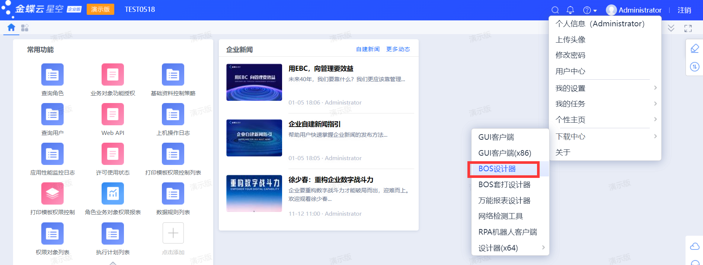

## 开发环境

### 环境要求

操作系统：Windows 10/11 （由于服务器依托IIS，推荐安装专业版）

开发语言：C#、Python（不能调试）

开发工具：Microsoft Visual Studio 2012及以上 （以下简称VS；插件仅需.NET Framework 4.0环境，可自行调整版本）

数据库：Microsoft SQL Server 2014及以上（推荐一步到位2019）

数据库管理工具：Microsoft SQL Server Management Studio、Navicat Premium

服务器：IIS

应用程序：金蝶云星空企业版（托管云端会自动更新，建议下载最新版）

### 安装过程

> 本文目录下已带有部分安装包，可直接使用。
>
> **若金蝶云星空安装过程中发现无法访问本地网站，请检查IIS是否关闭。**
>
> 金蝶云星空开放平台：https://open.kingdee.com/K3Cloud/Open/PTDownload.aspx
>
> 金蝶官方安装示例：https://vip.kingdee.com/article/83500607104976896?productLineId=1&isKnowledge=2
>
> **安装金蝶云星空过程中若出现任何错误，建议直接完整卸载后重装。**（安装出错后，再次打开金蝶安装文件默认显示卸载按钮）

1. 首先安装SQL Server数据库。**特别提醒：Windows 11 不兼容SQL Server所有版本安装于系统目录（C盘）中，需要安装在其他硬盘内。**

2. 其次安装金蝶云星空，进入检查界面后按照页面提示进行环境修复。**特别提醒：若操作系统安装的是家庭版金蝶安装会无法进行，需要通过本文安装包目录下的《家庭版跳过SSL检测》文件夹下的批处理进行跳过验证。**

3. 云星空环境安装完毕后根据官方示例**首先创建（注册）管理中心**，随后进入[管理中心](http://localhost:8000/)**恢复蓝海数据库**。恢复完成后至金蝶开发平台**下载最新补丁包并安装**，安装完毕后**再恢复备份的线上账套数据库**，恢复完成后**点击备份数据库进行升级**，升级完成即可进入[本地网站](http://localhost/K3Cloud)。

   

4. 最后安装其他开发工具。

### 搭建环境

除通过VS编写逻辑代码外，金蝶云星空另提供了一个开发工具**《金蝶云星空集成开发平台 》**（BOS设计器），所有页面及插件均需要在该工具上挂载。

1.进入网站主页后点击头像处进行下载。



2.下载完成后首先需要登录金蝶账号，其次需要绑定具有**BOS设计权限**的用户的账号。（若用户不具有BOS设计权限，需要自行进入金蝶网站内为用户增加权限，详情请自行搜索）


3.登录后，新建或打开应用。在项目上右键并点击搭建开发环境，根据页面提示进行操作，如下图：


4.完成环境搭建后，在插件工程上右键选择**新建插件工程**。需要新建插件时则在创建的该插件工程上右键**添加插件**。（该步骤类似于C#创建工程和新建类）可在文件上右键**在VS中打开**，也可定位到创建工程的目录打开。

### 忘记密码

1.若**遗忘administrator管理账户密码**，可在对应数据库执行下列sql语句，即可重置为默认密码【**<u>888888</u>**】六个八。

```sql
UPDATE t_sec_user
SET
fpassword = '9EF0664B011C3DC6305C8B213378BACC2451FAEA',
fmemo = '8d2fea58-cda1-4035-9024-56cc6df8957c'
FISLOCK = 0,
FUNLOCKTIME = '2020.01.01'
WHERE fuserid = 16394
```

若[管理中心](http://localhost:8000/)的密码忘记，可在以**K3DBConfiger**开头的数据库执行：


若[用户系统](http://localhost/K3Cloud)（账套）的密码忘记，可在自行设定名称的数据库上执行。

2.若**遗忘用户密码**，可进入[用户系统](http://localhost/K3Cloud)使用administrator账户登录，在系统管理-用户管理中找到**查询用户**功能。然后找到要修改密码的用户，点击菜单栏中的**重置密码**即可。


## 代码相关

详见开发文档。

## 发布上线

### 安装SVN

1.进入**正式环境**的**BOS设计器**，在选择应用界面点击右上角齿轮进入**工具箱**，下载并安装 **TortoiseSVN**。


2.安装完成后，**重启**集成开发平台。访问**金蝶开发环境的插件根目录**（通常是：*D:\WorkSpace\应用名\\Code*），选中**项目工程文件夹**右键点击 **SVN Commit** ，提交**项目工程文件夹下所有内容**。


### 打包

1.回到**集成开发平台**，右键项目选中**部分包构建**。


2.在弹出的**应用临时包构建**页面左侧选中要**打包的内容**（单据页面、插件项目工程等），点击中间的 **>** 号，右侧显示**选中的内容**。选择完成后点击**在线构建**。


3.最后回到主页面，上方**应用**选项中点击**我的应用**，在弹出的应用选择界面点击应用旁的**更多操作**里的**查看该应用的构建历史**，在弹出的列表中点击刚刚打包的安装包进行下载。


### 补丁包本地测试

1.下载完成后，运行补丁包。首先输入**[管理中心](http://localhost:8000/) administrator**用户的密码，然后点击**高级**选项。

2.勾选**允许重复导入**、**允许重复执行**，并选择要安装的**数据中心**名称。**（不勾选两个重复选项可能会出现执行了但没安装上去的情况，请务必勾选。）**


3.安装完成后，**重启IIS**，登录[本地网站](http://localhost/K3Cloud)查看安装是否成功。**（通常安装完成会自动关闭IIS，若出现安装完无法访问网站，请检查IIS状态；若安装完出现严重错误无法运行，建议直接重装金蝶云星空）**

### 补丁包线上发布

公有云情况无法直接发布，需要在[金蝶云 • 天梯 (kdcloud.com)](https://ops.kdcloud.com/)**提工单后由金蝶方进行安装部署**。
